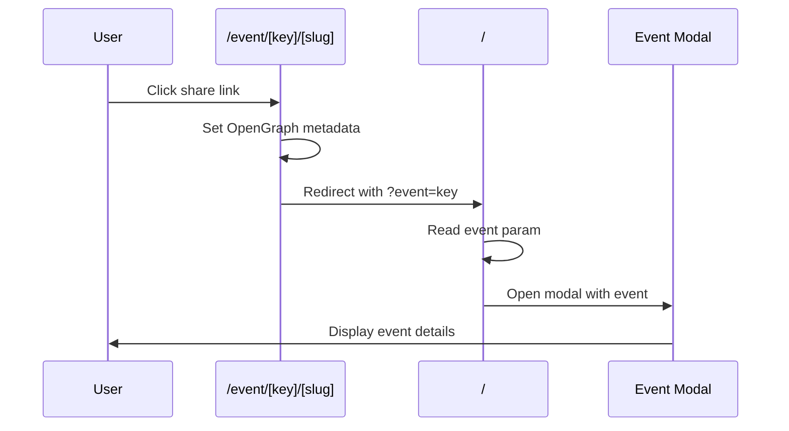

OOOC Fête Finder uses a stable event identity model so shared links continue working even when event content is edited or rows are reordered in the admin.

## Core model

Each event has three identity components:

1. **`eventKey`**: Canonical immutable identity (e.g., `evt_ab12cd34ef56`)
2. **Event content**: Editable fields (name, date, location, genre, etc.)
3. **`slug`**: Human-readable URL text (decorative, not used for lookup)

<Info>
Only `eventKey` is canonical for event lookup. The slug is purely decorative for SEO and user experience.
</Info>

## URL contract

Public share links use this pattern:

```
/event/<eventKey>/<slug>/
```

Example:
```
/event/evt_ab12cd34ef56/jazz-concert-at-parc-montsouris/
```

### Redirect behavior

The `/event/[eventKey]/[[...slug]]/` route:

1. Sets OpenGraph metadata for social sharing
2. Redirects to homepage with query parameters:
   ```
   /?event=evt_ab12cd34ef56&slug=jazz-concert-at-parc-montsouris
   ```
3. Homepage modal state opens the event based on `event` parameter

<Note>
If the slug is wrong or missing, the app still resolves the event correctly using only the `eventKey`.
</Note>

## Event key generation

Event keys are generated using deterministic hashing:

```typescript
// features/data-management/assembly/event-key.ts
import { generateEventKeyFromRow } from './assembly/event-key'

const eventKey = generateEventKeyFromRow(
  { name: 'Jazz Concert', date: '2024-06-21', location: 'Parc Montsouris' },
  {
    stableKeys: ['name', 'date', 'location'], // Fields used in fingerprint
    hashLength: 16 // Default: 16 characters
  }
)
// Result: evt_ab12cd34ef5678
```

### Generation algorithm

1. **Normalize fields**: Convert to lowercase, remove accents, trim whitespace
2. **Build fingerprint**: Concatenate stable keys in order
   ```
   name:jazz concert|date:2024-06-21|location:parc montsouris
   ```
3. **Hash with SHA-256**: Generate cryptographic hash
4. **Truncate and prefix**: Take first 16 characters, prefix with `evt_`

<Accordion title="View normalization implementation">
```typescript
const normalizeForFingerprint = (value: string): string => {
  return value
    .normalize('NFKD')
    .replace(/[\u0300-\u036f]/g, '') // Remove diacritics
    .toLowerCase()
    .trim()
    .replace(/\s+/g, ' ') // Normalize whitespace
}
```
</Accordion>

### Collision handling

If two events generate the same key, a salt is added:

```typescript
// Collision detected
let salt = 0
let generated = generateEventKeyFromRow(row, { salt })

while (usedKeys.has(generated)) {
  salt += 1
  generated = generateEventKeyFromRow(row, { salt })
}
```

## Key validation

Valid event keys must match this pattern:

```typescript
const EVENT_KEY_PATTERN = /^evt_[a-z0-9]{12,20}$/

export const normalizeEventKey = (
  value: string | null | undefined
): string | null => {
  if (!value) return null
  const normalized = value.trim().toLowerCase()
  return EVENT_KEY_PATTERN.test(normalized) ? normalized : null
}
```

Validation rules:
- Must start with `evt_` prefix
- Hash portion must be 12-20 lowercase alphanumeric characters
- No uppercase, spaces, or special characters

## CSV and admin behavior

### Import behavior

When importing CSV data:

```typescript
// features/data-management/assembly/event-key.ts
import { ensureUniqueEventKeys } from './assembly/event-key'

const csvRows = parseCSVContent(csvContent)
const result = ensureUniqueEventKeys(csvRows)

// result.rows: All rows with valid unique eventKey
// result.missingEventKeyCount: Number of rows without keys
// result.generatedEventKeyCount: Number of keys generated
```

<Info>
CSV imports accept `Event Key` column (plus common aliases like `eventKey`, `event_key`). Missing or invalid keys are generated and persisted.
</Info>

### Export behavior

CSV exports always include the `Event Key` column:

```csv
Event Key,Event Name,Date,Location
evt_ab12cd34ef56,Jazz Concert,2024-06-21,Parc Montsouris
evt_9876543210ab,Rock Festival,2024-06-21,Place de la République
```

### Admin editor

In the admin event sheet editor:

- `Event Key` column is **read-only**
- Cannot be manually edited
- System-managed field

<Warning>
Manually changing an existing event key will break all previously shared links to that event.
</Warning>

## Slug generation

Slugs are generated from event names for user-friendly URLs:

```typescript
// features/data-management/assembly/event-key.ts
export const buildEventSlug = (name: string): string => {
  const normalized = normalizeForFingerprint(name)
    .replace(/[^a-z0-9]+/g, '-')  // Replace non-alphanumeric with hyphens
    .replace(/^-+|-+$/g, '')       // Remove leading/trailing hyphens
  
  const trimmed = normalized.slice(0, 80).replace(/-+$/g, '')
  return trimmed || 'event'
}

// Example:
buildEventSlug('Jazz à Parc Montsouris')
// Result: 'jazz-a-parc-montsouris'
```

## Determinism rules

Event key behavior is deterministic and predictable:

1. **Existing valid keys are preserved** across saves and imports
2. **Missing keys are generated** from normalized row content
3. **Collisions are resolved** with deterministic salt increment
4. **Same content produces same key** (without salt)

## What breaks existing links

Shared links will break if:

1. **Manually changing an existing Event Key** in CSV before import
2. **Removing Event Key column** after keys were already established
3. **Intentionally assigning a new identity** for what should be a different event

<Warning>
Never manually edit or remove existing event keys unless you intend to break old share links.
</Warning>

## Operational note

After enabling event identity features or migrating data:

1. Load your current event data in admin
2. Save once to generate and persist keys
3. Export CSV to verify keys are included
4. Future imports will preserve these keys

## Share link flow

Complete flow from share link to event display:



## Client-side modal state

The homepage reads event identity from URL:

```typescript
// Client component reading URL params
const searchParams = useSearchParams()
const eventKey = searchParams.get('event')
const slug = searchParams.get('slug')

if (eventKey) {
  // Find event by key
  const event = events.find(e => e.eventKey === eventKey)
  if (event) {
    openEventModal(event)
  }
}
```

<Note>
The slug parameter is ignored for lookup. It's only used to preserve user-friendly URLs in the address bar.
</Note>

## Database queries

Event key is indexed for fast lookups:

```sql
-- Find event by key
SELECT * FROM app_event_store_rows
WHERE event_key = 'evt_ab12cd34ef56'

-- Engagement tracking uses event key
SELECT event_key, COUNT(*) as save_count
FROM app_event_engagement_stats
WHERE action_type = 'calendar_sync'
GROUP BY event_key
```

## Related documentation

<CardGroup cols={2}>
  <Card title="Architecture overview" href="/architecture/overview" icon="sitemap">
    System architecture and data contracts
  </Card>
  <Card title="Data flow" href="/architecture/data-flow" icon="arrow-right-arrow-left">
    Event processing and key hydration
  </Card>
  <Card title="Engagement tracking" href="/architecture/engagement-tracking" icon="chart-line">
    How event keys enable per-event analytics
  </Card>
  <Card title="API endpoints" href="/api/auth" icon="code">
    Event lookup and tracking endpoints
  </Card>
</CardGroup>